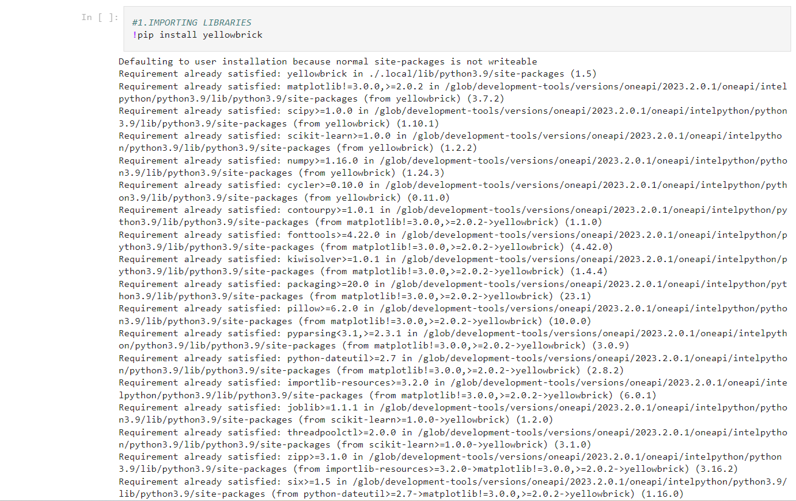

   <centre><h1>customer segmentation</centre> 
      

     

  

The Customer segmentation is a part of K-Means Clustering Algorithm.The K-Means Algorithm is an Unsupervised Learning algorithm.
<h2>ABOUT</h2>

**What is  K-Means Clustering Algorithm ?**
K-Means is a popular clustering algorithm used in machine learning and data analysis. 
It is an unsupervised learning technique that groups data points into clusters based on their similarity. 

**Importance of K-Means Clustering Algorithm **

1. K-Means helps in exploring and understanding the underlying structure within a dataset.
2. K-Means can be used in image compression by clustering similar pixel values together.
3. K-Means can be part of recommendation systems to cluster users or items based on their behavior or features. 
4. K-Means can be used for data reduction, which is valuable in scenarios where storage or transmission of data is costly or limited.

<h2>TECHNOLOGIES USED</h2>

  

The [Intel® OneAPI toolkit](https://www.intel.com/content/www/us/en/developer/tools/oneapi/toolkits.html#gs.3btkxe), [Intel® K-Mean Clustering algorithm](https://www.intel.com/content/www/us/en/docs/programmable/683395/current/k-mean-clustering-algorithm.html) The goal of K-Means clustering is to partition a dataset into K distinct, non-overlapping clusters, where each data point belongs to the cluster with the nearest mean.

<h2>YellowBrick</h2>
<li>Yellowbrick is a Python library that is designed to enhance the visualizations and diagnostics of machine learning models.</li>
<li>Yellowbrick includes tools for visualizing text data, such as term frequency-inverse document frequency (TF-IDF) matrices and visualizations for text classification tasks.</li>
 

**Features of Yellowbrick**
 <li>Users can visualize regression models using Yellowbrick, with features like residual plots, prediction error plots, and partial dependence plots for understanding how specific features affect predictions.</li>
 <li>Users can extend Yellowbrick by creating custom visualizers and integrating them into their machine learning pipelines, making it a flexible tool for specialized tasks.</li>
 
 

  

